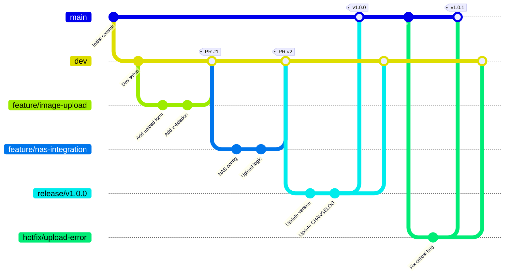
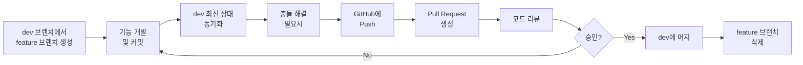
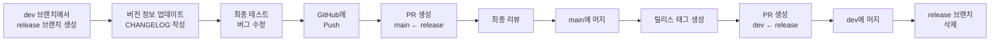
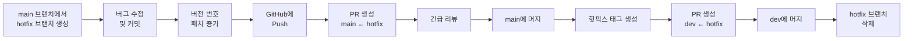

# Git Flow 가이드

WedSnap 프로젝트의 Git 브랜치 전략 및 워크플로우 가이드입니다.

## 📌 목차

- [Git Flow 개요](#git-flow-개요)
- [브랜치 전략](#브랜치-전략)
- [브랜치 네이밍 컨벤션](#브랜치-네이밍-컨벤션)
- [작업 프로세스](#작업-프로세스)
- [릴리스 브랜치 관리](#릴리스-브랜치-관리)
- [Pull Request 프로세스](#pull-request-프로세스)
- [브랜치 보호 규칙](#브랜치-보호-규칙)
- [커밋 메시지 컨벤션](#커밋-메시지-컨벤션)
- [자주 사용하는 Git 명령어](#자주-사용하는-git-명령어)
- [주의사항 및 Best Practices](#주의사항-및-best-practices)

---

## Git Flow 개요

WedSnap은 소규모 팀(2-5명)에 최적화된 **간소화된 Git Flow** 전략을 사용합니다. 이는 표준 Git Flow를 기반으로 하되, 팀 규모에 맞게 실용적으로 조정한 워크플로우입니다.

### 핵심 원칙

- `main` 브랜치는 항상 배포 가능한 상태 유지
- `dev` 브랜치에서 기능 통합 및 테스트
- 모든 코드 변경은 Pull Request를 통해 리뷰 후 머지
- 브랜치 네이밍 규칙을 준수하여 일관성 유지

---

## 브랜치 전략



### 주요 브랜치

| 브랜치    | 목적        | 수명 | 보호 설정       |
|--------|-----------|----|-------------|
| `main` | 운영 환경 배포용 | 영구 | ✅ Protected |
| `dev`  | 개발 통합 브랜치 | 영구 | ⚠️ 권장       |

### 보조 브랜치

| 브랜치 타입      | 목적        | 생성 기준  | 머지 대상         | 수명 |
|-------------|-----------|--------|---------------|----|
| `feature/*` | 새로운 기능 개발 | `dev`  | `dev`         | 임시 |
| `release/*` | 릴리스 준비    | `dev`  | `main`, `dev` | 임시 |
| `hotfix/*`  | 긴급 버그 수정  | `main` | `main`, `dev` | 임시 |

---

## 브랜치 네이밍 컨벤션

### 기본 규칙

- **소문자 사용**: 모든 브랜치명은 소문자로 작성
- **kebab-case**: 단어 구분은 하이픈(`-`) 사용
- **간결하고 명확하게**: 브랜치 목적을 쉽게 파악할 수 있도록 작성
- **영어 사용**: 일관성을 위해 영어로 작성

### Feature 브랜치

**형식**: `feature/<기능명>`

**예시**:

```
feature/image-upload
feature/qr-code-generation
feature/user-authentication
feature/nas-integration
feature/upload-progress-bar
```

### Release 브랜치

**형식**: `release/v<버전>`

**버전 규칙**: [Semantic Versioning](https://semver.org/) 준수 (Major.Minor.Patch)

**예시**:

```
release/v1.0.0
release/v1.1.0
release/v2.0.0
```

### Hotfix 브랜치

**형식**: `hotfix/<버그명>` 또는 `hotfix/v<버전>`

**예시**:

```
hotfix/upload-error
hotfix/nas-connection-fail
hotfix/security-patch
hotfix/v1.0.1
```

### 브랜치명 작성 팁

**좋은 예시**:

```
feature/multi-file-upload
feature/image-thumbnail
release/v1.2.0
hotfix/memory-leak
```

**나쁜 예시**:

```
feature/test          # 너무 모호함
Feature/Upload        # 대문자 사용
feature/add_upload    # 언더스코어 사용
feature/기능추가       # 한글 사용
```

---

## 작업 프로세스

### 1. 기능 개발 프로세스 (Feature)



#### 단계별 명령어

```bash
# 1. dev 브랜치 최신 상태로 업데이트
git checkout dev
git pull origin dev

# 2. feature 브랜치 생성 및 전환
git checkout -b feature/image-upload

# 3. 기능 개발 및 커밋
git add .
git commit -m "feat: 이미지 업로드 기능 추가"

# 4. 개발 중 dev 최신 변경사항 반영 (주기적으로)
git fetch origin dev
git rebase origin/dev
# 또는
git merge origin/dev

# 5. GitHub에 푸시
git push origin feature/image-upload

# 6. GitHub에서 PR 생성 (dev ← feature/image-upload)

# 7. 리뷰 승인 후 머지 완료되면 로컬 브랜치 정리
git checkout dev
git pull origin dev
git branch -d feature/image-upload
```

### 2. 릴리스 프로세스 (Release)



#### 릴리스 브랜치의 기본 원리

**release 브랜치는 dev 브랜치를 기반으로 생성됩니다.** 이는 release 브랜치를 생성하는 시점의 dev 브랜치 상태를 "스냅샷"으로 가져오는 것을 의미합니다.

```bash
git checkout dev
git pull origin dev
git checkout -b release/v1.0.0  # 이 시점의 dev 브랜치 모든 커밋이 포함됨
```

즉, release 브랜치 생성 시점까지 dev 브랜치에 머지된 모든 feature들이 자동으로 포함됩니다. release 브랜치는 dev의 특정 시점 복사본으로 시작하여, 릴리스 준비 작업(버전 업데이트, CHANGELOG 작성, 버그 수정 등)만 추가로 진행합니다.

#### 단계별 명령어

```bash
# 1. dev 브랜치 최신 상태로 업데이트
git checkout dev
git pull origin dev

# 2. release 브랜치 생성
git checkout -b release/v1.0.0

# 3. 버전 정보 업데이트 (build.gradle, CHANGELOG.md 등)
# - build.gradle의 version 수정
# - CHANGELOG.md 업데이트
git add .
git commit -m "chore: v1.0.0 릴리스 준비"

# 4. 버그 수정이 필요한 경우
git commit -m "fix: 릴리스 전 버그 수정"

# 5. GitHub에 푸시
git push origin release/v1.0.0

# 6. GitHub에서 PR 생성 (main ← release/v1.0.0)

# 7. 리뷰 승인 후 main에 머지

# 8. main 브랜치에 태그 생성
git checkout main
git pull origin main
git tag -a v1.0.0 -m "Release v1.0.0"
git push origin v1.0.0

# 9. dev에도 릴리스 변경사항 반영
# GitHub에서 PR 생성 (dev ← release/v1.0.0) 후 머지

# 10. 로컬 브랜치 정리
git checkout dev
git pull origin dev
git branch -d release/v1.0.0
```

### 3. 긴급 수정 프로세스 (Hotfix)



#### 단계별 명령어

```bash
# 1. main 브랜치 최신 상태로 업데이트
git checkout main
git pull origin main

# 2. hotfix 브랜치 생성
git checkout -b hotfix/upload-error

# 3. 버그 수정
git add .
git commit -m "fix: 업로드 실패 오류 수정"

# 4. 버전 번호 업데이트 (v1.0.0 → v1.0.1)
# build.gradle의 version 수정
git add build.gradle
git commit -m "chore: v1.0.1 핫픽스"

# 5. GitHub에 푸시
git push origin hotfix/upload-error

# 6. GitHub에서 PR 생성 (main ← hotfix/upload-error)

# 7. 긴급 리뷰 후 main에 머지

# 8. main 브랜치에 태그 생성
git checkout main
git pull origin main
git tag -a v1.0.1 -m "Hotfix v1.0.1"
git push origin v1.0.1

# 9. dev에도 핫픽스 반영
# GitHub에서 PR 생성 (dev ← hotfix/upload-error) 후 머지

# 10. 로컬 브랜치 정리
git checkout dev
git pull origin dev
git branch -d hotfix/upload-error
```

---

## 릴리스 브랜치 관리

릴리스 브랜치가 생성된 후에도 dev 브랜치에서는 계속 개발이 진행됩니다. 이 섹션에서는 릴리스 준비 중 발생할 수 있는 다양한 시나리오와 대응 방법을 설명합니다.

### 기본 원칙

1. **release 브랜치는 안정화에 집중**
    - 새로운 기능 추가 금지
    - 버전 정보 업데이트, CHANGELOG 작성, 버그 수정만 허용

2. **dev는 계속 진행**
    - release 브랜치 생성 후에도 dev에서 다음 버전 개발 진행 가능
    - dev의 모든 변경사항이 자동으로 release에 포함되지 않음

3. **선택적 반영**
    - release에 반드시 필요한 변경사항만 선택적으로 반영
    - `cherry-pick` 또는 수동 수정 사용

### 시나리오 1: dev에서 중요한 버그가 수정된 경우

release 준비 중 dev 브랜치에서 릴리스에 반드시 포함되어야 할 버그가 수정된 경우, `cherry-pick`을 사용하여 해당 커밋만 release 브랜치에 반영합니다.

#### 상황 예시

```bash
# 현재 상태:
# - release/v1.0.0 브랜치에서 릴리스 준비 중
# - dev 브랜치에서 critical bug 수정 (commit hash: abc1234)
```

#### 해결 방법

```bash
# 1. release 브랜치로 전환
git checkout release/v1.0.0

# 2. dev의 최신 상태 확인
git fetch origin dev

# 3. dev에서 수정된 커밋의 해시 확인
git log origin/dev --oneline -10

# 4. 필요한 커밋을 cherry-pick으로 가져오기
git cherry-pick abc1234

# 5. 충돌이 발생한 경우 해결 후
git add .
git cherry-pick --continue

# 6. release 브랜치에 푸시
git push origin release/v1.0.0
```

#### 주의사항

- cherry-pick은 커밋을 복사하는 것이므로, 같은 변경사항이 다른 커밋 해시로 두 브랜치에 존재하게 됩니다
- release를 main과 dev 모두에 머지하면 최종적으로 중복이 해소됩니다

### 시나리오 2: release에서 발견된 버그를 dev에도 반영

release 브랜치에서 버그를 수정한 경우, 해당 수정사항을 즉시 dev에도 반영해야 합니다.

#### 방법 1: Cherry-pick (권장)

```bash
# 1. release 브랜치에서 버그 수정 후 커밋
git checkout release/v1.0.0
git add .
git commit -m "fix: 릴리스 테스트 중 발견된 버그 수정"
git push origin release/v1.0.0

# 2. 커밋 해시 확인
git log --oneline -1
# 예: def5678 fix: 릴리스 테스트 중 발견된 버그 수정

# 3. dev 브랜치로 전환하여 동일한 수정 반영
git checkout dev
git pull origin dev
git cherry-pick def5678

# 4. dev에 푸시
git push origin dev
```

#### 방법 2: PR을 통한 반영

```bash
# 1. release 브랜치에서 버그 수정 후 푸시
git checkout release/v1.0.0
git add .
git commit -m "fix: 릴리스 테스트 중 발견된 버그 수정"
git push origin release/v1.0.0

# 2. GitHub에서 PR 생성 (dev ← release/v1.0.0)
# 3. 리뷰 후 머지
```

**참고**: 릴리스 프로세스 완료 후 release 브랜치를 dev에 머지하면 자동으로 반영되지만, 긴급한 버그 수정은 즉시 dev에 반영하는 것이 좋습니다.

### 시나리오 3: release 준비가 오래 걸리는 경우

release 브랜치 작업이 예상보다 오래 걸리고, dev의 여러 중요한 변경사항을 반영해야 하는 경우입니다.

#### 권장하지 않는 방법: dev 전체 머지

```bash
# ❌ 이 방법은 권장하지 않습니다
git checkout release/v1.0.0
git merge dev  # 다음 버전용 기능까지 모두 포함될 수 있음
```

**문제점**: dev에 이미 다음 버전(v1.1.0)을 위한 기능들이 추가되었다면, 이것들까지 v1.0.0 릴리스에 포함되어 버립니다.

#### 권장 방법: 선택적 Cherry-pick

```bash
# 1. dev의 로그 확인하여 필요한 커밋 식별
git log origin/dev --oneline --since="2025-10-01"

# 2. 필요한 커밋들만 cherry-pick
git checkout release/v1.0.0
git cherry-pick abc1234
git cherry-pick def5678
git cherry-pick ghi9012

# 3. 푸시
git push origin release/v1.0.0
```

#### 대안: 릴리스를 빨리 마무리

release 브랜치가 오래 걸린다는 것은 릴리스 프로세스에 문제가 있을 수 있습니다:

- release 브랜치 생성 전 dev에서 충분한 테스트를 수행했는지 확인
- release 브랜치에서는 최소한의 작업만 수행
- 릴리스 목표를 명확히 하여 범위를 제한

### 시나리오 4: dev의 새로운 기능을 release에 포함해야 하는 경우

release 브랜치 생성 후 dev에 추가된 새로운 기능을 릴리스에 포함해야 한다는 요구가 있는 경우입니다.

#### 권장 답변

**"해당 기능은 다음 릴리스(v1.1.0)에 포함하는 것이 좋습니다."**

릴리스 브랜치는 안정화 단계이므로, 새로운 기능 추가는 릴리스 범위를 벗어나는 것입니다.

#### 정말 포함해야 한다면

```bash
# 1. 기능 관련 커밋들 확인 (feature 브랜치가 dev에 머지된 커밋)
git log origin/dev --oneline --grep="feat: 긴급 기능"

# 2. feature의 모든 커밋을 순서대로 cherry-pick
git checkout release/v1.0.0
git cherry-pick abc1234  # feature의 첫 번째 커밋
git cherry-pick abc1235  # feature의 두 번째 커밋
# ... 모든 관련 커밋

# 3. 충분한 테스트 후 푸시
git push origin release/v1.0.0
```

**주의**: 이 경우 릴리스 일정이 지연될 수 있으며, 새로운 버그가 발생할 위험이 높습니다.

### 요약: 릴리스 브랜치 관리 가이드라인

| 상황                      | 해결 방법                   | 도구                      |
|-------------------------|-------------------------|-------------------------|
| dev의 버그 수정을 release에 반영 | 필요한 커밋만 가져오기            | `git cherry-pick`       |
| release의 버그 수정을 dev에 반영 | 즉시 dev에 반영              | `git cherry-pick` 또는 PR |
| release 작업이 오래 걸림       | 선택적으로 필요한 커밋만 반영        | `git cherry-pick`       |
| dev의 새 기능을 release에 포함  | 다음 릴리스로 연기 권장           | -                       |
| 여러 변경사항 반영 필요           | 각 커밋을 개별적으로 cherry-pick | `git cherry-pick`       |

### 주의사항

1. **release 브랜치에서 dev로의 자동 머지는 없습니다**
    - release에서 수정한 내용은 명시적으로 dev에 반영해야 합니다
    - 릴리스 완료 후 release → dev PR을 통해 최종 반영합니다

2. **dev 전체를 release에 머지하지 마세요**
    - 의도하지 않은 기능이 릴리스에 포함될 수 있습니다
    - 항상 선택적으로 필요한 커밋만 가져오세요

3. **cherry-pick 시 충돌 주의**
    - 충돌이 자주 발생한다면 코드베이스가 너무 빠르게 변하고 있다는 신호입니다
    - release 브랜치 작업 기간을 단축하는 것을 고려하세요

4. **릴리스 범위를 명확히 하세요**
    - release 브랜치 생성 전 릴리스에 포함될 기능을 명확히 정의
    - "feature freeze" 시점을 팀원들에게 공지

---

## Pull Request 프로세스

### PR 생성 규칙

#### PR 제목 형식

```
<type>: <제목>
```

**예시**:

```
feat: 이미지 다중 업로드 기능 추가
fix: NAS 연결 실패 오류 수정
docs: Git Flow 가이드 문서 작성
refactor: 파일 업로드 서비스 리팩토링
```

#### PR 설명 템플릿

```markdown
## 변경 사항

<!-- 무엇을 변경했는지 간단히 설명 -->

## 변경 이유

<!-- 왜 이 변경이 필요한지 설명 -->

## 테스트 방법

<!-- 어떻게 테스트했는지 설명 -->

- [ ] 로컬 환경에서 테스트 완료
- [ ] 단위 테스트 추가/업데이트
- [ ] 통합 테스트 확인

## 스크린샷 (필요시)

<!-- UI 변경사항이 있는 경우 스크린샷 첨부 -->

## 체크리스트

- [ ] 코드 스타일 가이드 준수
- [ ] 관련 문서 업데이트
- [ ] 테스트 통과
- [ ] 충돌 해결 완료
```

### 코드 리뷰 가이드

#### 리뷰어 체크리스트

- [ ] **기능성**: 코드가 의도한 대로 동작하는가?
- [ ] **가독성**: 코드가 이해하기 쉬운가?
- [ ] **보안**: 보안 취약점은 없는가?
- [ ] **성능**: 성능 이슈는 없는가?
- [ ] **테스트**: 적절한 테스트가 포함되어 있는가?
- [ ] **문서**: 필요한 문서가 업데이트되었는가?

#### 리뷰 피드백 예시

**건설적인 피드백**:

```
✅ "이 부분은 별도 메서드로 분리하면 재사용성이 높아질 것 같습니다."
✅ "NullPointerException 가능성이 있어 보입니다. null 체크를 추가하면 좋을 것 같습니다."
✅ "좋은 구현입니다! 다만 변수명을 좀 더 명확하게 하면 어떨까요?"
```

**피해야 할 피드백**:

```
❌ "이 코드는 잘못되었습니다."
❌ "왜 이렇게 짰나요?"
```

### PR 머지 규칙

1. **필수 승인**: 최소 1명 이상의 팀원 승인 필요
2. **충돌 해결**: 모든 충돌을 해결한 후 머지
3. **테스트 통과**: CI/CD 테스트가 있는 경우 통과 필수
4. **브랜치 삭제**: 머지 후 feature/hotfix 브랜치는 삭제

#### 머지 전 체크리스트

- [ ] 최소 1명 이상 승인
- [ ] 모든 대화(conversation) 해결
- [ ] 충돌 없음
- [ ] 테스트 통과 (있는 경우)
- [ ] 최신 base 브랜치와 동기화

---

## 브랜치 보호 규칙

### main 브랜치 보호 설정

GitHub Settings > Branches > Branch protection rules에서 다음 설정을 적용합니다:

#### 필수 설정

- ✅ **Require a pull request before merging**
    - Require approvals: 1명 이상
    - Dismiss stale pull request approvals when new commits are pushed

- ✅ **Require status checks to pass before merging** (CI/CD 설정 시)
    - Require branches to be up to date before merging

- ✅ **Do not allow bypassing the above settings**

- ✅ **Restrict who can push to matching branches**
    - 직접 push 금지

- ✅ **Force pushes**
    - Do not allow force pushes

#### 설정 효과

```
❌ git push origin main              # 실패: 직접 push 금지
❌ git push --force origin main      # 실패: force push 금지
✅ Pull Request를 통한 머지만 가능
```

### dev 브랜치 보호 설정 (권장)

실수로 인한 직접 push를 방지하기 위해 dev 브랜치에도 보호 설정을 권장합니다:

- ✅ **Require a pull request before merging**
    - Require approvals: 1명 (선택 사항)

---

## 커밋 메시지 컨벤션

### Conventional Commits 기반 규칙

**형식**:

```
<type>(<scope>): <subject>

<body>

<footer>
```

### Type 종류

| Type       | 설명                           | 예시                        |
|------------|------------------------------|---------------------------|
| `feat`     | 새로운 기능 추가                    | `feat: 이미지 다중 업로드 기능 추가`  |
| `fix`      | 버그 수정                        | `fix: NAS 연결 타임아웃 오류 수정`  |
| `docs`     | 문서 수정                        | `docs: README에 설치 가이드 추가` |
| `style`    | 코드 포맷팅, 세미콜론 누락 등 (동작 변경 없음) | `style: 코드 포맷팅 적용`        |
| `refactor` | 코드 리팩토링 (기능 변경 없음)           | `refactor: 파일 업로드 로직 개선`  |
| `test`     | 테스트 코드 추가/수정                 | `test: 업로드 서비스 단위 테스트 추가` |
| `chore`    | 빌드, 설정 변경 등                  | `chore: Gradle 의존성 업데이트`  |
| `perf`     | 성능 개선                        | `perf: 이미지 압축 알고리즘 최적화`   |

### Subject 작성 규칙

- 명령형, 현재 시제 사용 ("추가함" ❌, "추가" ✅)
- 첫 글자는 소문자 (영어의 경우)
- 마침표 없음
- 50자 이내로 간결하게

### 예시

#### 기본 커밋

```bash
git commit -m "feat: QR 코드 생성 기능 추가"
git commit -m "fix: 이미지 업로드 실패 시 에러 처리 개선"
git commit -m "docs: Git Flow 가이드 문서 작성"
```

#### Scope 포함

```bash
git commit -m "feat(upload): 파일 크기 제한 기능 추가"
git commit -m "fix(nas): 연결 재시도 로직 수정"
```

#### Body 포함

```bash
git commit -m "feat: 이미지 썸네일 생성 기능 추가

업로드된 이미지의 썸네일을 자동 생성하여
미리보기 성능을 개선합니다.

- 썸네일 크기: 200x200
- 지원 형식: JPG, PNG
- 캐싱 적용"
```

#### Footer 포함 (이슈 연결)

```bash
git commit -m "fix: NAS 업로드 타임아웃 오류 수정

연결 타임아웃을 30초로 증가시켜
대용량 파일 업로드 시 발생하는 오류를 해결합니다.

Closes #123"
```

---

## 자주 사용하는 Git 명령어

### 브랜치 관리

```bash
# 브랜치 목록 확인
git branch                  # 로컬 브랜치
git branch -r               # 원격 브랜치
git branch -a               # 모든 브랜치

# 브랜치 생성 및 전환
git checkout -b feature/new-feature     # 생성과 동시에 전환
git switch -c feature/new-feature       # 최신 방식

# 브랜치 전환
git checkout dev            # checkout 방식
git switch dev              # 최신 방식

# 브랜치 삭제
git branch -d feature/old-feature       # 로컬 브랜치 삭제 (머지된 경우)
git branch -D feature/old-feature       # 강제 삭제
git push origin --delete feature/old-feature  # 원격 브랜치 삭제
```

### 동기화 및 병합

```bash
# 원격 저장소 최신 상태 가져오기
git fetch origin

# 현재 브랜치를 원격과 동기화
git pull origin dev

# 다른 브랜치의 변경사항 가져오기
git merge dev               # dev 브랜치를 현재 브랜치에 머지
git rebase dev              # dev 브랜치 위로 현재 브랜치 재배치

# 특정 커밋만 가져오기
git cherry-pick <commit-hash>
```

### 변경사항 확인

```bash
# 상태 확인
git status

# 변경사항 확인
git diff                    # 작업 디렉토리 vs Staging
git diff --staged           # Staging vs 마지막 커밋
git diff dev                # 현재 브랜치 vs dev 브랜치

# 커밋 히스토리
git log                     # 기본 로그
git log --oneline           # 한 줄로 요약
git log --graph --oneline --all  # 그래프로 모든 브랜치 표시
```

### 임시 저장 (Stash)

```bash
# 현재 작업 임시 저장
git stash

# 저장 목록 확인
git stash list

# 저장한 작업 복원
git stash apply             # 최신 stash 적용 (stash 유지)
git stash pop               # 최신 stash 적용 (stash 삭제)

# 특정 stash 복원
git stash apply stash@{1}

# Stash 삭제
git stash drop              # 최신 stash 삭제
git stash clear             # 모든 stash 삭제
```

### 실수 복구

```bash
# 마지막 커밋 수정
git commit --amend          # 마지막 커밋 메시지 수정 또는 파일 추가

# 파일 변경 취소
git checkout -- <file>      # 작업 디렉토리의 변경사항 취소
git restore <file>          # 최신 방식

# Staging 취소
git reset HEAD <file>       # Staging 영역에서 제거
git restore --staged <file> # 최신 방식

# 커밋 취소
git reset --soft HEAD~1     # 커밋만 취소 (변경사항 유지)
git reset --hard HEAD~1     # 커밋과 변경사항 모두 취소 (주의!)
```

### 유용한 명령어 조합

```bash
# 현재 브랜치 정보 포함한 상태 확인
git status -sb

# 최근 5개 커밋 간단히 보기
git log --oneline -5

# 특정 파일의 변경 히스토리
git log --follow <file>

# 브랜치 간 차이 확인
git diff dev..main

# 원격 저장소 URL 확인
git remote -v

# 로컬 브랜치와 원격 브랜치 연결
git branch --set-upstream-to=origin/dev dev
```

---

## 주의사항 및 Best Practices

### ✅ 권장 사항

1. **자주 커밋하기**
    - 작은 단위로 자주 커밋
    - 하나의 커밋은 하나의 논리적 변경사항만 포함

2. **Pull 먼저, Push 나중에**
   ```bash
   git pull origin dev    # 항상 최신 상태로 업데이트
   git push origin dev    # 그 후 푸시
   ```

3. **브랜치는 작고 빠르게**
    - Feature 브랜치는 가능한 한 작게 유지
    - 개발 기간이 길어지면 중간에 dev와 동기화

4. **머지 전에 충돌 해결**
   ```bash
   git fetch origin dev
   git rebase origin/dev    # 또는 git merge origin/dev
   # 충돌 해결 후
   git push origin feature/my-feature
   ```

5. **의미 있는 커밋 메시지**
    - 나중에 커밋 히스토리를 볼 때 이해하기 쉽게 작성
    - "수정", "변경", "작업" 같은 모호한 메시지 지양

### ❌ 피해야 할 사항

1. **main에 직접 푸시 금지**
   ```bash
   # ❌ 절대 하지 말 것
   git checkout main
   git push origin main
   ```

2. **force push 지양**
   ```bash
   # ❌ 공유 브랜치에서 절대 금지
   git push --force origin dev

   # ✅ 본인만 사용하는 feature 브랜치에서만 신중히 사용
   git push --force origin feature/my-feature
   ```

3. **WIP 커밋으로 PR 생성 금지**
    - "WIP", "임시", "테스트" 같은 커밋은 정리 후 PR 생성
    - `git rebase -i`로 커밋 정리 가능

4. **dev 브랜치에서 직접 개발 금지**
    - 항상 feature 브랜치를 생성하여 작업

5. **대용량 파일 커밋 금지**
    - 바이너리 파일, 빌드 산출물 등은 `.gitignore`에 추가
    - 필요시 Git LFS 사용 고려

### 🔧 문제 해결 팁

#### 1. 머지 충돌 발생 시

```bash
# 1. 충돌 발생
git merge dev
# CONFLICT (content): Merge conflict in file.txt

# 2. 충돌 파일 확인
git status

# 3. 파일 편집하여 충돌 해결
# <<<<<<< HEAD
# 현재 브랜치 내용
# =======
# 머지할 브랜치 내용
# >>>>>>> dev

# 4. 해결 완료 후
git add file.txt
git commit -m "chore: 머지 충돌 해결"
```

#### 2. 잘못된 브랜치에서 작업한 경우

```bash
# 현재: dev 브랜치에서 작업 중 (실수!)
# 목표: feature/new-feature 브랜치로 이동

# 1. 변경사항 임시 저장
git stash

# 2. 올바른 브랜치 생성 및 전환
git checkout -b feature/new-feature

# 3. 변경사항 복원
git stash pop
```

#### 3. 원격 브랜치가 삭제된 경우

```bash
# 로컬에 남아있는 원격 브랜치 참조 정리
git fetch --prune

# 또는
git remote prune origin
```

### 🎯 소규모 팀을 위한 추가 팁

1. **일일 동기화**
    - 하루 시작 전 `dev` 브랜치 `pull`
    - 작업 종료 후 feature 브랜치 `push`

2. **빠른 리뷰 사이클**
    - PR은 가능한 한 빨리 리뷰
    - 작은 PR은 30분 이내 리뷰 목표

3. **커뮤니케이션**
    - 큰 변경사항은 사전에 팀원과 논의
    - PR에 충분한 설명 작성

4. **주기적인 브랜치 정리**
    - 머지된 feature 브랜치는 즉시 삭제
    - 오래된 브랜치는 주기적으로 확인 및 정리

---

## 참고 자료

- [Git Flow 원문](https://nvie.com/posts/a-successful-git-branching-model/)
- [Semantic Versioning](https://semver.org/)
- [Conventional Commits](https://www.conventionalcommits.org/)
- [GitHub Flow](https://guides.github.com/introduction/flow/)
- [Git 공식 문서](https://git-scm.com/doc)

---

## 문서 개정 이력

| 버전    | 날짜         | 변경 내용 | 작성자 |
|-------|------------|-------|-----|
| 1.0.0 | 2025-10-12 | 초안 작성 | -   |

---

**문의사항이나 개선 제안은 이슈로 등록해 주세요.**
